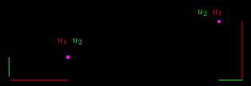
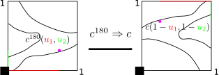
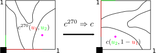
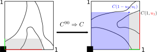
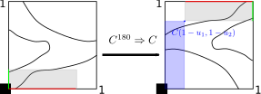
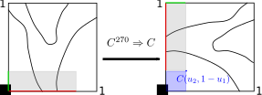

# Clockwise rotation

The most prominent copula modification is a rotation of a given copula
by either 90, 180 or 270 degrees. Thereby one can rotate in two
different directions: clockwise or counter clockwise. This page shows
the derivation of [pdf](#pdf), [cdf](#cdf), [h- and
v-functions](#h-v-fun) for clockwise rotation, which is the default
setting of this package. In order to get the respective formulas for
counter clockwise rotation, take a look at this [page](ccw_rot.html).

When deriving the individual formulas it helps to look at a concrete
example, which shall be illustrated by the following contour line
plots of a copula pdf:

When using new copulas obtained through modification of given copulas,
properties like pdf or v-function are calculated by relating them to
properties of the respective original copula.

## pdf

In order to derive the pdf value of a given rotated copula, the
rotation needs to be reverted and the original copula be evaluated at
the a obtained point with new coordinates. For example, for a 90
degrees clockwise rotation and the given purple point shown on the
left, the coordinates in terms of the original underlying copula
without rotation can be seen on the right. Going from the left to the
right figure, the rotation has been reverted.

Hence, we get the pdf value of a clockwise 90° rotated copula with

$$\begin{aligned}
c^{90}(u_{1},u_{2})&=c(1-u_{2},u_{1})
\end{aligned}$$

The same procedure also works for 180 and 270 degrees:

To sum up, the following formulas for pdf values of clockwise rotated
copulas hold: 

$$\begin{aligned}
c^{90}(u_{1},u_{2})&=c(1-u_{2},u_{1})
\end{aligned}$$

$$\begin{aligned}
c^{180}(u_{1},u_{2})&=c(1-u_{1},1-u_{2})
\end{aligned}$$

$$\begin{aligned}
c^{270}(u_{1},u_{2})&=c(u_{2},1-u_{1})
\end{aligned}$$

## cdf

The logic for the cdf of a rotated copula is quite similar. Recalling
the definition of the copula cdf, $$C(u_{1},u_{2})$$ is just an
integration of the probability mass contained in a rectangular
starting at the origin with upper right corner given by
$$(u_{1},u_{2})$$. Reverting the rotation, the same rectangular can be
found in a different location of the original underlying copula.
Therefore, we need to make use of the formula for integration of a
general rectangular $$[a_{1},a_{2}]\times[b_{1},b_{2}]$$ for a copula,
often called $$H$$-volume [REFERENCE_KEY!]:

$$C(a_{2}, b_{2})-C(a_{1},b_{2})-C(a_{2},b_{1})+C(a_{1},b_{1})$$

Hence, for any given rectangular starting at the origin the location
needs to be found after reversion of the rotation. In the following
plots this is illustrated through the gray shaded rectangular. 

Once the coordinates are fixed for the original un-rotated copula, the
$$H$$-volume of the rectangular can be calculated through the standard
formula:

$$\begin{aligned}
C^{90}(u_{1},u_{2})&=C(1,u_{1})-C(1-u_{2},u_{1})\\
&=u_{1} - C(1-u_{2},u_{1})
\end{aligned}$$

The same also holds for rotations of 180 and 270 degrees:

$$\begin{aligned}
C^{180}(u_{1},u_{2})&=1-C(1-u_{1},1)-C(1,1-u_{2})+C(1-u_{1},1-u_{2})\\
&=u_{1}+u_{2}+C(1-u_{1},1-u_{2})-1
\end{aligned}$$

$$\begin{aligned}
C^{270}(u_{1},u_{2})&=C(u_{2},1)-C(u_{2},1-u_{1})\\
&=u_{2}-C(u_{2},1-u_{1})
\end{aligned}$$

## h- and v-functions

As $$h$$- and $$v$$-functions are just partial derivatives of a copula
(REFERENCE_KEY), they can easily be derived from the cdf formulas for
rotated copulas. Here are the respective formulas as a lookup table: 

$$\begin{aligned}
h^{90}(u_{1},u_{2})&=v(u_{1},1-u_{2})\\
h^{180}(u_{1},u_{2})&=1-h(1-u_{1},1-u_{2})\\
h^{270}(u_{1},u_{2})&=1-v(1-u_{1},u_{2})\\
\end{aligned}$$

$$\begin{aligned}
v^{90}(u_{2},u_{1})&=1-h(1-u_{2},u1)\\
v^{180}(u_{2},u_{1})&=1-v(1-u_{2},1-u_{1})\\
v^{270}(u_{2},u_{1})&=h(u_{2},1-u_{1})
\end{aligned}$$

#### Proof: 90° rotation

$$\begin{aligned}
h^{90}(u_{1},u_{2})&=\partial_{2}C^{90}(u_{1},u_{2})\\
&=\frac{\partial C^{90}(u_{1},u_{2})}{\partial u_{2}}\\
&=\frac{\partial(u_{1}-C(1-u_{2},u_{1}))}{\partial u_{2}}\\
&=-\partial_{1} C(1-u_{2},u_{1})(-1)\\
&=v(u_{1},1-u_{2})
\end{aligned}$$

$$\begin{aligned}
v^{90}(u_{2},u_{1})&=\partial_{1}C^{90}(u_{1},u_{2})\\
&=\frac{\partial C^{90}(u_{1},u_{2})}{\partial u_{1}}\\
&=\frac{\partial(u_{1}-C(1-u_{2},u_{1}))}{\partial u_{1}}\\
&=1-\partial_{2}C(1-u_{2},u_{1})\\
&=1-h(1-u_{2},u_{1})
\end{aligned}$$

#### Proof: 180° rotation

$$\begin{aligned}
h^{180}(u_{1},u_{2})&=\frac{\partial C^{180}(u_{1},u_{2})}{\partial u_{2}}\\
&=\frac{\partial (u_{1}+u_{2}+C(1-u_{1},1-u_{2})-1)}{\partial u_{2}}\\
&=1+ \partial_{2}C(1-u_{1},1-u_{2})(-1)\\
&=1-h(1-u_{1},1-u_{2})
\end{aligned}$$

$$\begin{aligned}
v^{180}(u_{2},u_{1})&=\frac{\partial C^{180}(u_{1},u_{2})}{\partial u_{1}}\\
&=\frac{\partial (u_{1}+u_{2}+C(1-u_{1},1-u_{2})-1)}{\partial u_{1}}\\
&=1+ \partial_{1}C(1-u_{1},1-u_{2})\cdot \frac{\partial
(1-u_{1})}{\partial u_{1}}\\
&=1-v(1-u_{2},1-u_{1})
\end{aligned}$$

#### Proof: 270° rotation

$$\begin{aligned}
h^{270}(u_{1},u_{2})&=\frac{\partial C^{270}(u_{1},u_{2})}{\partial u_{2}}\\
&=\frac{\partial(u_{2}-C(u_{2},1-u_{1}))}{\partial u_{2}}\\
&=1- \partial_{1} C(u_{2},1-u_{1})\\
&=1-v(1-u_{1},u_{2})
\end{aligned}$$

$$\begin{aligned}
v^{270}(u_{2},u_{1})&=\frac{\partial C^{270}(u_{1},u_{2})}{\partial u_{1}}\\
&=\frac{\partial (u_{2}-C(u_{2},1-u_{1}))}{\partial u_{1}}\\
&=-\partial_{2}C(u_{2},1-u_{1})\cdot \frac{\partial(1-u_{1})}{\partial u_{1}}\\
&=h(u_{2},1-u_{1})
\end{aligned}$$

## inverse h- and v-functions

With given $$h$$- and $$v$$-functions the following inverses can be
derived: 

$$\begin{aligned}
(h^{90})^{-1}(x,u_{2})&=v^{-1}(x,1-u_{2})\\
(h^{180})^{-1}(x, u_{2})&=1-h^{-1}(1-x,1-u_{2})\\
(h^{270})^{-1}(x, u_{2})&=1-v^{-1}(1-x,u_{2})
\end{aligned}$$

$$\begin{aligned}
(v^{90})^{-1}(x,u_{1})&=1-h^{-1}(1-x,u_{1})\\
(v^{180})^{-1}(x, u_{1})&=1-v^{-1}(1-x,1-u_{1})\\
(v^{270})^{-1}(x, u_{1})&=h^{-1}(x,1-u_{1})
\end{aligned}$$

#### Proof: 90° rotation

$$\begin{aligned}
h^{90}(y,u_{2})&=x&\Leftrightarrow \\
v(y,1-u_{2})&=x&\Leftrightarrow \\
y &= v^{-1}(x,1-u_{2})
\end{aligned}$$

$$\begin{aligned}
v^{90}(y,u_{1})&=x&\Leftrightarrow \\
1-h(1-y,u_{1})&=x&\Leftrightarrow \\
1-x&=h(1-y,u_{1})&\Leftrightarrow \\
h^{-1}(1-x,u_{1})&=1-y&\Leftrightarrow \\
y&=1-h^{-1}(1-x,u_{1})
\end{aligned}$$

#### Proof: 180° rotation

$$\begin{aligned}
h^{180}(y,u_{2})&=x&\Leftrightarrow \\
1-h(1-y,1-u_{2})&=x&\Leftrightarrow \\
1-x &= h(1-y,1-u_{2})&\Leftrightarrow \\
h^{-1}(1-x,1-u_{2})&=1-y&\Leftrightarrow \\
y&=1-h^{-1}(1-x,1-u_{2})
\end{aligned}$$

$$\begin{aligned}
v^{180}(y,u_{1})&=x&\Leftrightarrow \\
1-v(1-y,1-u_{1})&=x&\Leftrightarrow \\
v^{-1}(1-x,1-u_{1})&=1-y&\Leftrightarrow \\
y&=1-v^{-1}(1-x,1-u_{1})
\end{aligned}$$

#### Proof: 270° rotation

$$\begin{aligned}
h^{270}(y,u_{2})&=x&\Leftrightarrow \\
1-v(1-y,u_{2})&=x&\Leftrightarrow \\
1-x&= v(1-y,u_{2})&\Leftrightarrow \\
v^{-1}(1-x,u_{2})&=1-y&\Leftrightarrow \\
y&=1-v^{-1}(1-x,u_{2})
\end{aligned}$$

$$\begin{aligned}
v^{270}(y,u_{1})&=x&\Leftrightarrow \\
h(y,1-u_{1})&=x&\Leftrightarrow \\
y&=h^{-1}(x,1-u_{1})
\end{aligned}$$
