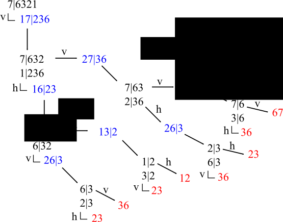

# Pair copula construction

Generally, any joint distribution can be decomposed into a product of
conditional distributions with increasing conditioning set:

$$\begin{aligned}
f(x_{1},\ldots,x_{n})&=f(x_{1})\cdot f(x_{2}|x_{1})\cdot \ldots \cdot f(x_{n}|x_{1},\ldots ,x_{n-1})
\end{aligned}$$

$$\begin{aligned}
f(x_{2}|x_{1})&=\frac{f(x_{1},x_{2})}{f(x_{1})}
\end{aligned}$$

Through Sklar's theorem, this can be written in terms of the
underlying copula: 

$$\begin{aligned}
f(x_{1},x_{2})&=c_{12}(F_{1}(x_{1}), F_{2}(x_{2}))f_{1}(x_{1})f_{2}(x_{2})
\end{aligned}$$

Hence, we get:

$$\begin{aligned}
f(x_{2}|x_{1})&=\frac{f(x_{1},x_{2})}{f(x_{1})}\\
&=\frac{c_{12}(F_{1}(x_{1}), F_{2}(x_{2}))f_{1}(x_{1})f_{2}(x_{2})}{f(x_{1})}\\
&=c_{12}(F_{1}(x_{1}), F_{2}(x_{2}))f_{2}(x_{2})
\end{aligned}$$

For a given two-dimensional distribution 

How do we get the individual conditional distributions?

# Example

As pair copula constructions become quite complicated in higher
dimensions, we want to introduce most of the theory with the aid of a
concrete example. In this example, we look at the joint distribution
of 7 variables. The following network visualization shall give a first
impression of how individual variables get connected in our pair
copula construction. Nevertheless, this graph is in no way unique, so
that any visual characteristics like proximity could be due to
graphical artifacts only. Also, we only show conditional links up to
layer 3:

# R-Vines

Transforming an R-Vine matrix to tree notation:

Calculation of PITs:

References
---------

<iframe src="../refs/html_refs/rvines.html" width="600" height="200"></iframe>

# Visualization

There are several ways of visualizing a vine copula density
decomposition:

- one rooted tree per variable (unique representation)
- one directed tree per layer (copula vine trees)
- a graph:
  - fully connected, if all conditional links are shown
  - partly connected, if only first layers are shown
  - visualization in a single graph is highly non-unique
