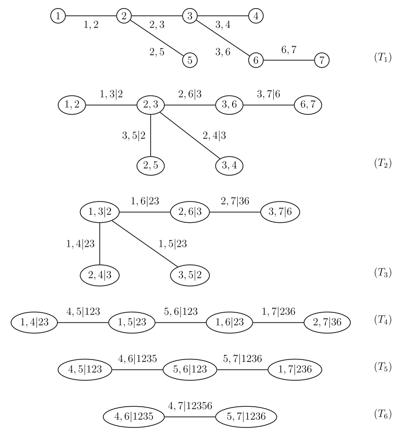

# Example

As pair copula constructions become quite complicated in higher
dimensions, we want to introduce most of the theory with the aid of a
concrete example. In this example, we look at the joint distribution
of 7 variables. The following network visualization shall give a first
impression of how individual variables get connected in our pair
copula construction. Nevertheless, this graph is in no way unique, so
that any visual characteristics like proximity could be due to
graphical artifacts only. Also, we only show conditional links up to
layer 3:

# R-Vines

Transforming an R-Vine matrix to tree notation:

## Standard notation

We will use the example of Dißmann (page 31):

As [Dißmann13](#refs) shows, this vine decomposition can be expressed
as R-Vine matrix. Two possible R-Vine matrices are (page 36):

$$\begin{pmatrix}
4 & & & & & & \\
7 & 5 & & & & & \\
6 & 7 & 1 & & & & \\
5 & 6 & 7 & 7 & & & \\
1 & 1 & 6 & 2 & 6 & & \\
2 & 3 & 3 & 3 & 2 & 2 & \\
3 & 2 & 2 & 6 & 3 & 3 & 3 
\end{pmatrix}$$

$$\begin{pmatrix}
7 & & & & & & \\
4 & 4 & & & & & \\
5 & 6 & 6 & & & & \\
1 & 5 & 5 & 5 & & & \\
2 & 1 & 1 & 1 & 1 & & \\
3 & 2 & 2 & 3 & 3 & 3 & \\
6 & 3 & 3 & 2 & 2 & 2 & 2 
\end{pmatrix}$$

## Alternative notation

$$\begin{pmatrix}
0 & 2 & 2 & 2 & 3 & 2 & 2 \\
1 & 0 & 3 & 3 & 5 & 3 & 3 \\
2 & 2 & 0 & 4 & 2 & 6 & 6 \\
3 & 3 & 3 & 0 & 1 & 5 & 5 \\
3 & 2 & 2 & 1 & 0 & 1 & 1 \\
3 & 3 & 3 & 5 & 1 & 0 & 7 \\
6 & 6 & 6 & 6 & 6 & 6 & 0 
\end{pmatrix}$$

References
---------

<iframe src="../refs/html_refs/rvine_example.html" width="600" height="200"></iframe>
